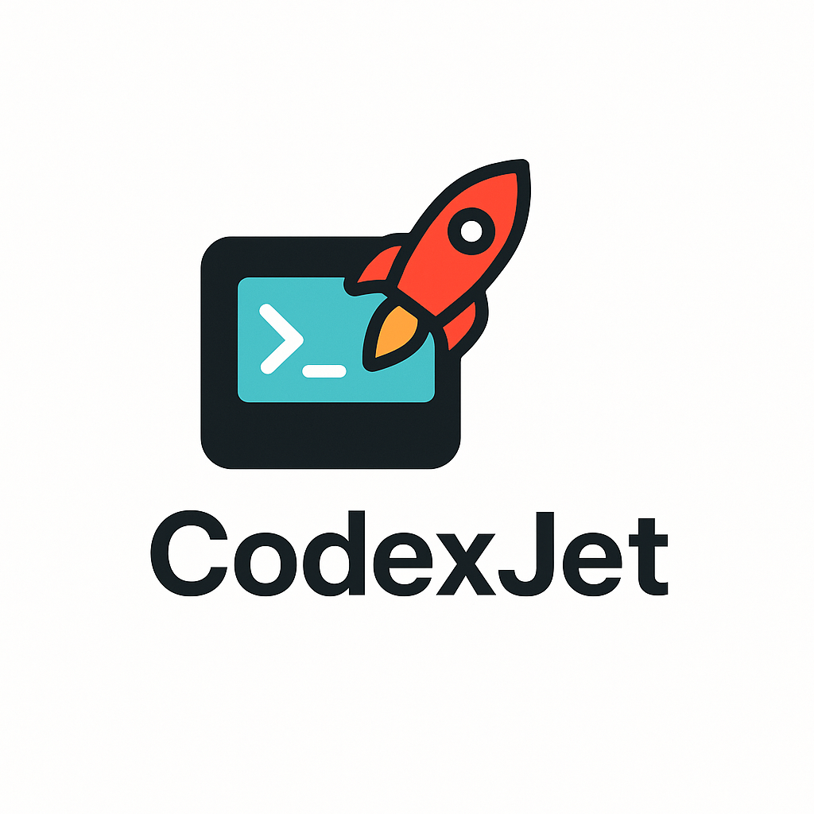

# JetBrains Codex Plugin



A JetBrains IDE plugin that integrates with the Codex app-server to run AI-powered conversations, surface tool calls, and live-stream events directly in your IDE.

## Features

- **Conversation Management**: Create and manage Codex conversations within the IDE
- **Real-time Event Streaming**: View agent reasoning, tool calls, command execution, and file patches as they happen
- **Interactive Approvals**: Approve or deny command executions and file changes through dialogs
- **Timeline View**: Track all tool calls, searches, plan updates, and errors in a dedicated panel
- **Project-Aware**: Automatically uses project directory as conversation context

## Requirements

- IntelliJ IDEA 2024.2 or later
- JDK 21 or later
- Codex CLI installed and available in PATH (`codex` command)

## Installation

### From Source

1. Clone this repository:
   ```bash
   git clone <repository-url>
   cd jb-codex
   ```

2. Build the plugin:
   ```bash
   ./gradlew buildPlugin
   ```

3. Install in IntelliJ:
   - Go to **Settings** → **Plugins** → **⚙️** → **Install Plugin from Disk**
   - Select `build/distributions/jetbrains-codex-plugin-0.1.0.zip`

## Usage

### Starting a Conversation

1. Open the **Codex** tool window (View → Tool Windows → Codex)
2. Click **Start Codex** to launch the app-server
3. Once initialized, type your message in the input field
4. Press **Send** or hit Enter

### Understanding the UI

The plugin provides two main panels:

**Conversation Transcript (Left)**
- Shows the full conversation history
- Displays user messages and agent responses
- Real-time streaming of agent output

**Event Timeline (Right)**
- Shows all tool calls and system events
- Displays command executions with output
- Shows file patch operations
- Tracks plan updates and usage statistics

### Approvals

When Codex wants to execute commands or modify files, approval dialogs will appear with:
- **Approve**: Allow this specific operation
- **Approve for Session**: Allow all similar operations in this session
- **Deny**: Block this operation (Codex will continue without it)
- **Abort**: Stop the entire conversation turn

## Development

### Running from Source

```bash
./gradlew runIde
```

This launches a new IntelliJ instance with the plugin installed.

### Running Tests

```bash
./gradlew test
```

### Project Structure

```
src/main/kotlin/com/jetbrains/codex/
├── core/
│   ├── CodexService.kt           # Main service managing lifecycle
│   ├── ProcessManager.kt         # Spawns and manages codex process
│   └── CodexProjectListener.kt   # Cleanup on project close
├── protocol/
│   ├── JsonRpcClient.kt          # JSON-RPC client implementation
│   ├── ConversationMethods.kt    # Conversation API methods
│   └── EventRouter.kt            # Event parsing and routing
└── ui/
    ├── CodexToolWindowFactory.kt # Tool window registration
    └── CodexChatPanel.kt         # Main UI panel
```

### Architecture

The plugin follows a modular architecture:

1. **ProcessManager**: Spawns `codex app-server` as subprocess, pipes STDIN/STDOUT
2. **JsonRpcClient**: Frames JSON Lines, correlates requests/responses, routes notifications
3. **EventRouter**: Parses `thread/*`, `turn/*`, and `item/*` notifications into typed Kotlin events
4. **CodexService**: Orchestrates initialization and lifecycle
5. **CodexChatPanel**: Renders UI and handles user interactions

## Protocol

The plugin communicates with Codex via JSON-RPC over JSON Lines (STDIN/STDOUT):

### Handshake
```json
→ {"id":1,"method":"initialize","params":{"clientInfo":{"name":"jetbrains-codex","title":"JetBrains Codex Plugin","version":"0.1.0"}}}
← {"id":1,"result":{"userAgent":"codex/..."}}
→ {"method":"initialized"}
```

### Starting a Thread
```json
→ {"id":2,"method":"thread/start","params":{"model":"gpt-4","cwd":"/project","approvalPolicy":"onRequest","sandbox":"workspace-write"}}
← {"id":2,"result":{"thread":{"id":"thr_123","modelProvider":"openai"}}}
← {"method":"thread/started","params":{"thread":{"id":"thr_123","model":"gpt-4"}}}
```

### Sending Turns
```json
→ {"id":3,"method":"turn/start","params":{"threadId":"thr_123","input":[{"type":"text","text":"Hello"}],"effort":"medium"}}
← {"method":"turn/started","params":{"threadId":"thr_123","turn":{"id":"turn_456"}}}
← {"method":"item/created","params":{"threadId":"thr_123","turnId":"turn_456","item":{"type":"assistant","text":"Hi there!"}}}
← {"method":"turn/completed","params":{"threadId":"thr_123","turn":{"id":"turn_456","status":"completed"}}}
```

See `app-server-doc.md` for the complete protocol documentation.

## Configuration

Currently, the plugin:
- Auto-detects `codex` binary from PATH
- Uses project base path as working directory
- Defaults to `gpt-4` model
- Sets approval policy to `onRequest`
- Uses `workspace-write` sandbox mode

Future versions will add a Settings UI for customization.

## Troubleshooting

### "codex binary not found"
Ensure `codex` is installed and in your PATH:
```bash
which codex
codex --version
```

### Connection Issues
Check IDE logs: **Help** → **Show Log in Finder/Explorer**

Look for `codex stderr:` lines showing server output.

### Test with Real Server
Uncomment the `@Ignore` annotation in `IntegrationTest.testRealCodexServer()` and run it to verify your Codex installation works correctly.

## Contributing

1. Fork the repository
2. Create a feature branch
3. Make your changes
4. Add tests for new functionality
5. Run `./gradlew test` and `./gradlew build`
6. Submit a pull request

## License

[Your License Here]

## References

- [Codex Documentation](https://docs.codex.ai)
- [IntelliJ Platform SDK](https://plugins.jetbrains.com/docs/intellij/)
- [Kotlin Coroutines](https://kotlinlang.org/docs/coroutines-overview.html)
